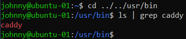

# ACIT 2420 Assignment 2

## Author
**Adrian Balcerak**

## Step 1
Follow along with the video to create:
* a VPC: 10.124.16.0/20
* two droplets: 137.184.11.22, and 164.92.124.144
* a load balancer: 143.244.208.55
* a firewall that: accepts inbound SSH traffic from all IPV4 and IPV6 addresses and inbound HTTP traffic from the load-balancer 143.244.208.55

## Step 2
Create regular users on each droplets from your **wsl**:

### Create Regular User
* ssh -i ~/.ssh/DO_key root@droplet_ip
* useradd -ms /bin/bash johnny
* usermod -aG sudo johnny
* passwd johnny
* rsync --archive --chown=johnny:johnny ~/.ssh /home/johnny 

## Step 3
Install a Web server on each droplet (using Caddy)

### Caddy Installation
1. ssh -i ~/.ssh/DO_key user@droplet_ip
2. wget https://github.com/caddyserver/caddy/releases/download/v2.6.2/caddy_2.6.2_linux_amd64.tar.gz
3. tar xvf caddy_2.6.2_linux_amd64.tar.gz
4. sudo chown root: caddy
5. sudo cp caddy /usr/bin/

You should now have an executable caddy file in your /usr/bin/ directory.



## Step 4
1. Install Node:

```
curl https://get.volta.sh | bash
volta install node
```

2. On your wsl, create a directory "2420-assign-two" and inside "2420-assign-two", create two more directories "html" and "src".
3. Inside html, create an index.html page:

```
<!DOCTYPE html>
<html lang="en">
<head>
    <meta charset="UTF-8">
    <meta http-equiv="X-UA-Compatible" content="IE=edge">
    <meta name="viewport" content="width=device-width, initial-scale=1.0">
    <title>Document</title>
</head>
<body>
    <b>Welcome to my home page.</b>
</body>
</html>
```

4. Inside the src directory, create a node project.

```
npm init //just skip through it
npm i fastify
touch index.js
```

index.js:

```
// Require the framework and instantiate it
const fastify = require('fastify')({ logger: true })

// Declare a route
fastify.get('/', async (request, reply) => {
  return { hello: 'Server x' }
})

// Run the server!
const start = async () => {
  try {
    await fastify.listen({ port: 3000 })
  } catch (err) {
    fastify.log.error(err)
    process.exit(1)
  }
}
start()
```

5. move the html and src directories to each droplet:

```
sftp -i ~/.ssh/key_file_name user@droplet_ip
put -r src
put -r html
```

## Step 5
### Create a Caddy config file on each droplet

```
sudo mkdir /etc/caddy
sudo touch /etc/caddy/Caddyfile
sudo vim /etc/caddy/Caddyfile
```

```

```

