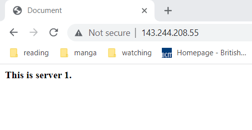
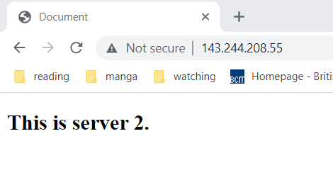
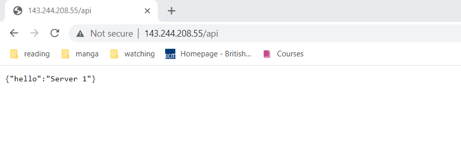
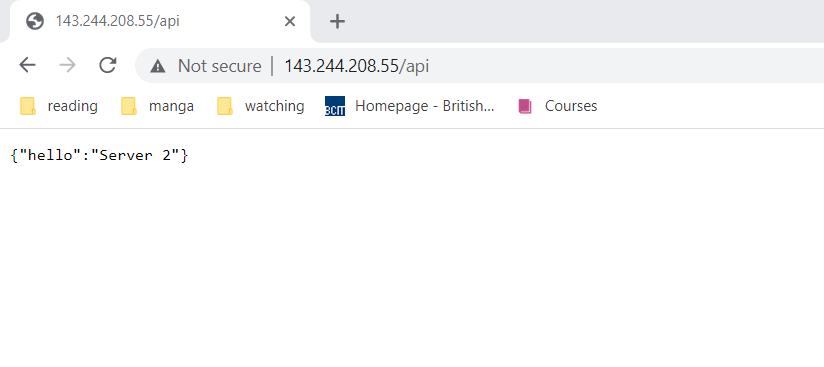

# ACIT 2420 Assignment 2

## Author
**Adrian Balcerak**

## Step 1
Follow along with the video to create:
* a VPC: 10.124.16.0/20
* two droplets: 137.184.11.22, and 164.92.124.144
* a load balancer: 143.244.208.55
* a firewall that: accepts inbound SSH traffic from all IPV4 and IPV6 addresses and inbound HTTP traffic from the load-balancer 143.244.208.55

## Step 2
Create regular users on each droplets from your **wsl**:

### Create Regular User
* ssh -i ~/.ssh/DO_key root@droplet_ip
* useradd -ms /bin/bash johnny
* usermod -aG sudo johnny
* passwd johnny
* rsync --archive --chown=johnny:johnny ~/.ssh /home/johnny 

## Step 3
Install a Web server on each droplet (using Caddy)

### Caddy Installation
1. ssh -i ~/.ssh/DO_key user@droplet_ip
2. wget https://github.com/caddyserver/caddy/releases/download/v2.6.2/caddy_2.6.2_linux_amd64.tar.gz
3. tar xvf caddy_2.6.2_linux_amd64.tar.gz
4. sudo chown root: caddy
5. sudo cp caddy /usr/bin/

You should now have an executable caddy file in your /usr/bin/ directory.


## Step 4
1. Install Node:

```
curl https://get.volta.sh | bash
volta install node
```

2. On your wsl, create a directory "2420-assign-two" and inside "2420-assign-two", create two more directories "html" and "src".
3. Inside html, create an index.html page:

```
<!DOCTYPE html>
<html lang="en">
<head>
    <meta charset="UTF-8">
    <meta http-equiv="X-UA-Compatible" content="IE=edge">
    <meta name="viewport" content="width=device-width, initial-scale=1.0">
    <title>Document</title>
</head>
<body>
    <b>Server 1/2</b>
</body>
</html>
```

4. Inside the src directory, create a node project.

```
npm init //just skip through it
npm i fastify
touch index.js
```

index.js:

```
// Require the framework and instantiate it
const fastify = require('fastify')({ logger: true })

// Declare a route
fastify.get('/api', async (request, reply) => {
  return { hello: 'Server 1/2' }
})

// Run the server!
const start = async () => {
  try {
    await fastify.listen({ port: 3030 })
  } catch (err) {
    fastify.log.error(err)
    process.exit(1)
  }
}
start()
```

5. move the html and src directories to each droplet:

```
sftp -i ~/.ssh/key_file_name user@droplet_ip
put -r src
put -r html
```

6. move the html and src directories

```
sudo mkdir -p ../../var/www/
sudo mv html /var/www/
sudo mv src /var/www/
```

## Step 5
### Create a Caddy config file on each droplet

```
sudo mkdir /etc/caddy
sudo touch /etc/caddy/Caddyfile
sudo vim /etc/caddy/Caddyfile
```

```
http://143.244.208.55 {
    root * /var/www
    reverse_proxy /api localhost:3030
    file_server
}
```

## Step 6
### Install node and npm with volta on each droplet

```
curl https://get.volta.sh | bash
source ~/.bashrc
volta install node
```

## Step 7
### Create a service file on host machine

touch hello_app.service
vim hello_app.service

```
[Unit]
Description=runs a hello world webapp
After=network-online.target
Wants=network-online.target

[Service]
ExecStart=/home/johnny/.volta/bin/node /var/www/src/index.js
User=johnny
Group=johnny
Restart=always
RestartSec=10
TimeoutStopSec=90
SyslogIdentifier=hello_app

[Install]
WantedBy=multi-user.target
```

## Step 8

1. sftp the service file to both servers
2. move the service file to the correct location

* sudo mv hello_app.service /etc/systemd/system

3. start the service

* sudo systemctl start hello_app.service
* sudo systemctl enable hello_app.service

4. create a caddy group and user:

* sudo groupadd --system caddy
* sudo useradd --system \
    --gid caddy \
    --create-home \
    --home-dir /var/lib/caddy \
    --shell /usr/sbin/nologin \
    --comment "Caddy web server" \
    caddy
    
5. give caddy ownership over the files it needs to host

* sudo chown caddy:caddy /var/www
* sudo chown caddy:caddy /var/www/html
* sudo chown caddy:caddy /var/www/src
* sudo chown caddy:caddy /var/www/html/index.html
* sudo chown caddy:caddy /var/www/src/index.js

6. Install and start the caddy service

* sudo sh -c 'curl https://raw.githubusercontent.com/caddyserver/dist/master/init/caddy.service > /etc/systemd/system/caddy.service'
* systemctl -daemon-reload
* sudo systemctl start caddy
* sudo systemctl enable caddy


## Step 9

1. Makes some differences between the html files.
2. Run both servers and observe the differences.

Server can be observed here http://143.244.208.55/








